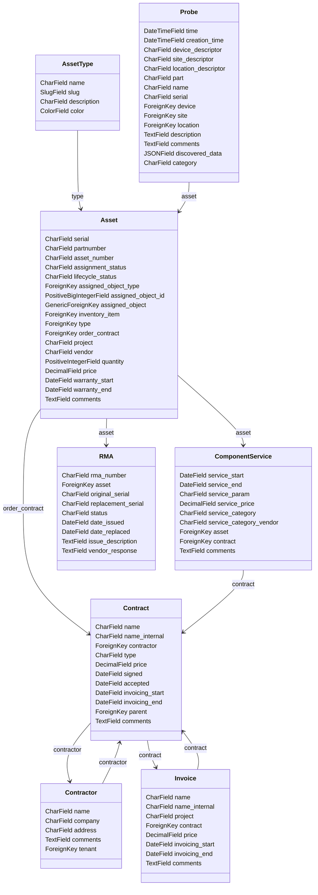

# Inventory Monitor

This project is designed to monitor and manage inventory assets, including their types, assignments, lifecycle statuses, and related contracts, services, invoices, and RMAs.

---

## Table of Contents

- [Attachments](#attachments)
- [Mermaid Diagram](#mermaid-diagram)
- [How the Data Model Works](#how-the-data-model-works)
- [Example Data and Relationships](#example-data-and-relationships)
- [Relationship Example](#relationship-example)
- [Installation](#installation)
- [Usage](#usage)
- [Contributing](#contributing)
- [License](#license)

---

## Attachments

- For attachments use [netbox-attachments](https://github.com/Kani999/netbox-attachments)

---

## Mermaid Diagram



---

## How the Data Model Works

1. **Contractor**
   - Represents an external company or individual providing services or assets.
   - Associated with multiple contracts (`Contract`).

2. **Contract**
   - Represents a business agreement, such as for purchasing assets or services.
   - Can have:
     - Multiple invoices (`Invoice`) for billing.
     - Subcontracts (`Contract`) for hierarchical contract management.
     - Assets (`Asset`) linked to the contract.
     - Services (`ComponentService`) provided as part of the contract.

3. **Invoice**
   - Linked to a contract, representing billing details.
   - Contains details about invoicing periods and project-specific billing.

4. **Asset**
   - Represents physical or logical assets involved in a project.
   - Includes details like serial number, price, vendor, warranty, and project association.
   - Linked to services (`ComponentService`) and devices, sites, locations, rack.
   - Can be linked with inventory items.

5. **ComponentService**
   - Represents services provided for an asset, such as maintenance or subscriptions.
   - Contains details about the service period, parameters, pricing, and service categories.

6. **Probe**
   - Represents measurements or data collection related to a device, site, or location.
   - Includes descriptors for identifying the context of the probe.

---

## Example Data and Relationships

### Scenario

- A contractor named **TechCorp** signs a contract for supplying assets and providing maintenance services for a project.
- The project involves purchasing routers and switches from **TechCorp**, with maintenance services for these assets.
- The contract also includes invoicing for specific periods.

### Data Example

#### Contractor

- **Name**: TechCorp
- **Company**: TechCorp Ltd.
- **Address**: 123 Main St, TechCity
- **Tenant**: Default Tenant

#### Contract

- **Name**: Network Infrastructure Supply
- **Type**: Supply and Maintenance
- **Price**: $100,000
- **Signed**: 2025-01-01
- **Invoicing Start**: 2025-01-15
- **Invoicing End**: 2026-01-15

#### Invoice

- **Name**: Invoice #001
- **Project**: Project Alpha
- **Price**: $25,000
- **Invoicing Start**: 2025-01-15
- **Invoicing End**: 2025-02-15

#### Asset

- **Serial**: R12345
- **Part Number**: RT-5000
- **Vendor**: TechCorp
- **Price**: $5,000
- **Warranty Start**: 2025-01-15
- **Warranty End**: 2028-01-15
- **Project**: Project Alpha

#### ComponentService

- **Service Start**: 2025-01-15
- **Service End**: 2026-01-15
- **Service Param**: Annual Maintenance
- **Service Price**: $1,000
- **Service Category**: Maintenance
- **Service Category Vendor**: TechCorp

#### Probe

- **Time**: 2025-02-01 10:00:00
- **Device Descriptor**: RT-5000 Router
- **Site Descriptor**: Data Center 1
- **Location Descriptor**: Rack A1
- **Part**: Router Module
- **Name**: Temperature Check
- **Serial**: R12345
- **Description**: Router temperature measurement.

---

## Relationship Example

1. **TechCorp** is linked to the **Network Infrastructure Supply** contract.
2. The contract includes:
   - An **asset** (router) with serial number R12345.
   - A **service** for annual maintenance of the router.
   - An **invoice** for January 2025 billing.
3. The **asset** is associated with:
   - A **site** (Data Center 1).
   - A **location** (Rack A1).
   - A **device** (RT-5000 Router).
4. A **probe** captures performance data (temperature) for the router at a specific time.

This structure enables easy tracking of assets, contracts, invoices, and services within the NetBox plugin.

---

## Installation

To install the Inventory Monitor plugin, follow these steps:

1. Clone the repository:
    ```sh
    git clone https://gitlab.cesnet.cz/701/done/inventory-monitor-plugin.git
    cd inventory-monitor-plugin
    ```

2. Run the setup script:
    ```sh
    python setup.py install
    ```
## OR 

3. **The plugin is available as a Python package on PyPI and can be installed with pip**:
    ```sh
    pip install inventory-monitor 
    ```
---


4. To enable the plugin, add it to the `PLUGINS` list in your `configuration.py`:
    ```python
    PLUGINS = [
        "inventory_monitor",
    ]
    ```

5. Run the database migrations:
    ```sh
    python manage.py migrate
    ```

---

## Usage

To use the Inventory Monitor plugin, follow these steps:

1. Start the application:
    ```sh
    python manage.py runserver
    ```

2. Access the application in your web browser at `http://localhost:8000`.

---

## Contributing

We welcome contributions to the Inventory Monitor project! To contribute, follow these steps:

1. Fork the repository.
2. Create a new branch for your feature or bugfix.
3. Make your changes and commit them with clear and concise messages.
4. Push your changes to your fork.
5. Submit a pull request to the main repository.

---

## License

This project is licensed under the MIT License. See the LICENSE file for more details.