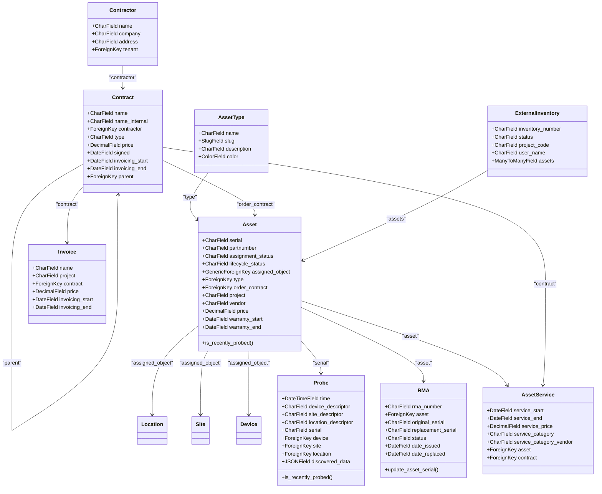

# NetBox Inventory Monitor Plugin

A comprehensive NetBox plugin for asset management with semi-automatic discovery processes. This plugin extends NetBox with powerful inventory tracking capabilities, including asset lifecycle management, probe monitoring, contract tracking, and RMA (Return Merchandise Authorization) processing.

[](https://gitlab.cesnet.cz/701/done/inventory-monitor-plugin)
[](https://github.com/netbox-community/netbox)
[](https://www.python.org/)

---

## Features

- **🏷️ Asset Management**: Track physical and logical assets with detailed metadata
- **📊 Probe Monitoring**: Visual status indicators for discovery data populated by external scripts (e.g., SNMP scans)
- **📝 Contract Tracking**: Manage contracts, contractors, and invoicing
- **🔄 RMA Processing**: Complete RMA workflow with serial number tracking
- **🏢 External Inventory**: Integration with external inventory systems
- **🛠️ Asset Services**: Track maintenance and service contracts
- **📈 Lifecycle Management**: Full asset lifecycle status tracking
- **🔍 Advanced Search**: Powerful filtering and search capabilities
- **🎨 Visual Interface**: Rich UI with status indicators and color coding
- **🔌 NetBox Integration**: Native NetBox plugin following best practices

---

## Table of Contents

- [Features](#features)
- [Data Model Overview](#data-model-overview)
- [Data Models](#data-models)
- [Installation](#installation)
- [Configuration](#configuration)
- [Usage](#usage)
- [API](#api)
- [Development](#development)
- [License](#license)
- [Acknowledgments](#acknowledgments)

---

## Data Model Overview



---

## Data Models

### Core Models

#### **Asset**
The central model representing physical or logical inventory items.

**Key Fields:**
- `serial`: Unique identifier for the asset
- `partnumber`: Manufacturer part number
- `assignment_status`: Current assignment status (stocked, assigned, retired, etc.)
- `lifecycle_status`: Lifecycle stage (new, in_use, maintenance, decommissioned, etc.)
- `assigned_object`: Generic foreign key to NetBox objects (Device, Site, Location, etc.)
- `type`: Link to AssetType for categorization
- `order_contract`: Associated purchase contract
- `warranty_start/end`: Warranty period tracking

**Special Features:**
- Probe status integration with `is_recently_probed()` method
- Generic assignment to any NetBox object
- Integration with External Inventory systems

#### **Probe**
Discovery and monitoring data collection points populated by external scripts (e.g., SNMP discovery tools).

**Key Fields:**
- `time`: Timestamp of the probe data collection
- `serial`: Links to Asset via serial number matching
- `device_descriptor`, `site_descriptor`, `location_descriptor`: Context information from discovery
- `discovered_data`: JSON field for flexible data storage from external tools
- `category`: Probe type classification

**Note**: Probe data is populated by external discovery scripts, not generated by the plugin itself.

#### **Contract & Contractor**
Business relationship management.

**Contract Features:**
- Hierarchical contracts (parent/child relationships)
- Invoice tracking
- Service associations
- Asset procurement tracking

#### **RMA (Return Merchandise Authorization)**
Complete RMA workflow management.

**Key Features:**
- Automatic serial number updates upon completion
- Status tracking (investigating, authorized, shipped, completed, cancelled)
- Integration with Asset lifecycle

#### **AssetService**
Service and maintenance contract tracking.

**Features:**
- Service period management
- Pricing and category tracking
- Links to both Assets and Contracts

#### **ExternalInventory**
Integration with external inventory management systems.

**Features:**
- Many-to-many relationship with Assets
- Project code tracking
- Status synchronization

---

## Installation

### Requirements

- NetBox 4.4.0 or higher
- Python 3.10 or higher

### From PyPI (Recommended)

```bash
pip install inventory-monitor
```

### From Source

```bash
git clone https://github.com/CESNET/inventory-monitor-plugin.git
cd inventory-monitor-plugin
pip install .
```

### NetBox Configuration

1. Add the plugin to your NetBox `configuration.py`:

```python
PLUGINS = [
    "inventory_monitor",
]
```

2. Run database migrations:

```bash
python manage.py migrate
```

3. Restart NetBox services:

```bash
sudo systemctl restart netbox netbox-rq
```

---

## Configuration

### Plugin Settings

Configure the plugin in your NetBox `configuration.py`:

```python
PLUGINS_CONFIG = {
    "inventory_monitor": {
        # Probe Status Settings
        "probe_recent_days": 7,  # Days to consider probe "recent"
        
        # External Inventory Status Configuration
        "external_inventory_status_config": {
            "1": {"label": "Active", "color": "success"},
            "0": {"label": "Pending Activation", "color": "warning"},
            "2": {"label": "Decommissioned", "color": "danger"},
        },
        
        # Custom tooltip template for status display
        "external_inventory_tooltip_template": "<span class='badge text-bg-{color}'>{code}</span> {label}",
    }
}
```

### Configuration Options

#### Probe Status Settings
- **`probe_recent_days`** (default: 7): Number of days to consider a probe "recent". Affects visual indicators and status badges.

#### External Inventory Status Configuration
- **`external_inventory_status_config`**: Maps status codes to display labels and Bootstrap colors
- **`external_inventory_tooltip_template`**: Template string for formatting status tooltips

**Status Configuration Structure:**
```python
{
    "status_code": {
        "label": "Human readable label",
        "color": "bootstrap_color_class"  # primary, secondary, success, danger, warning, info, light, dark
    }
}
```

**Template Variables:**
- `{code}`: The status code
- `{label}`: The translated label
- `{color}`: The Bootstrap color class

### Integration with NetBox Attachments

For file attachments, install and configure [netbox-attachments](https://github.com/Kani999/netbox-attachments):

```bash
pip install netbox-attachments
```

---

## Usage

### Accessing the Plugin

After installation, the plugin adds an "Inventory Monitor" section to the NetBox navigation menu with the following sections:

#### Assets
- **Assets**: Main asset inventory management
- **Asset Types**: Asset categorization and classification
- **RMA**: Return Merchandise Authorization tracking
- **External Inventory**: External system integration
- **Services**: Asset service and maintenance contracts

#### Network Probe
- **Probes**: Discovery and monitoring data
- **Data Locations**: Probe data organization

#### Contracts
- **Contractors**: Vendor and service provider management
- **Contracts**: Business agreement tracking
- **Invoices**: Billing and invoice management

### Basic Workflow

1. **Set up Asset Types**: Define categories for your assets
2. **Add Contractors**: Register vendors and service providers
3. **Create Contracts**: Define business agreements
4. **Register Assets**: Add inventory items with full metadata
5. **Populate Probe Data**: Use external scripts (SNMP, discovery tools) to populate monitoring data
6. **Track Services**: Manage maintenance and service contracts
7. **Process RMAs**: Handle return merchandise authorizations

### Probe Status Monitoring

The plugin provides visual feedback for probe status:
- **Green indicators**: Recent probes (within configured days)
- **Red indicators**: Stale probes (older than configured threshold)
- **Status badges**: Clear visual indicators in asset lists and details

### Asset Assignment

Assets can be assigned to any NetBox object using GenericForeignKey:
- Devices
- Sites
- Locations
- Racks
- And more...

---

## API

The plugin provides a full REST API following NetBox patterns:

### Available Endpoints

- `/api/plugins/inventory-monitor/assets/` - Asset management
- `/api/plugins/inventory-monitor/asset-types/` - Asset type management
- `/api/plugins/inventory-monitor/probes/` - Probe data access
- `/api/plugins/inventory-monitor/contracts/` - Contract management
- `/api/plugins/inventory-monitor/contractors/` - Contractor management
- `/api/plugins/inventory-monitor/invoices/` - Invoice tracking
- `/api/plugins/inventory-monitor/asset-services/` - Service management
- `/api/plugins/inventory-monitor/rmas/` - RMA processing
- `/api/plugins/inventory-monitor/external-inventory/` - External inventory integration

### API Features

- **Full CRUD operations** on all models
- **Advanced filtering** with NetBox's built-in filter backend
- **Pagination** for large datasets
- **Search capabilities** across relevant fields
- **Bulk operations** for efficient data management
- **OpenAPI/Swagger documentation** at `/api/docs/`


---

## Development

### Architecture Overview

The plugin follows NetBox plugin best practices:

#### Models Architecture
```
Asset ←→ Probe (via serial number matching)
Asset → AssetType
Asset → Contract (order_contract)
Asset ← GenericForeignKey (assigned to Device, Site, Location, etc.)
Asset ←→ RMA (via serial numbers)
Asset ←→ ExternalInventory (many-to-many)
```

#### Key Components
1. **Models**: Core business logic with probe status methods
2. **Views**: Standard NetBox generic views with enhancements
3. **Tables**: Django-tables2 with probe status indicators
4. **Templates**: Custom templates with integrated status visualization
5. **API**: DRF-based REST API following NetBox patterns
6. **Configuration**: Plugin settings via `default_settings`

### Performance Considerations

- **Database Optimizations**: Proper indexing on frequently queried fields
- **Query Optimization**: Use of `select_related()` and `prefetch_related()`
- **Caching**: Consider caching probe status for large asset lists

### Settings Access Pattern

```python
# Recommended approach
from inventory_monitor.settings import get_probe_recent_days
days = get_probe_recent_days()

# Alternative approach
from inventory_monitor.settings import get_plugin_settings
settings = get_plugin_settings()
days = settings.get("probe_recent_days", 7)
```

---

## License

This project is licensed under the MIT License. See the LICENSE file for more details.

---

## Acknowledgments

- Built for the [NetBox](https://github.com/netbox-community/netbox) ecosystem
- Part of the CESNET infrastructure management toolkit